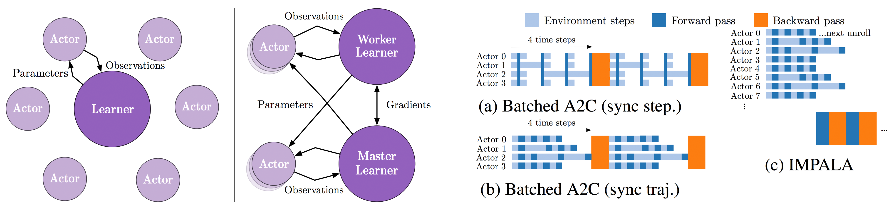

# IMPALA A2C in TensorFlow (in progress)

TensorFlow implementation of [IMPALA: Scalable Distributed Deep-RL with Importance Weighted Actor-Learner Architectures](https://arxiv.org/abs/1802.01561) with Advantage Actor Critic (A2C).

## Prerequisites

- Python 3.6+
- [TensorFlow 1.6.0](http://pytorch.org/)

## Usage

(in progress)

## Author

Taehoon Kim / [@carpedm20](http://carpedm20.github.io/)
